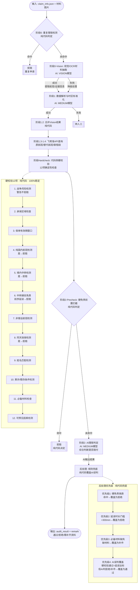
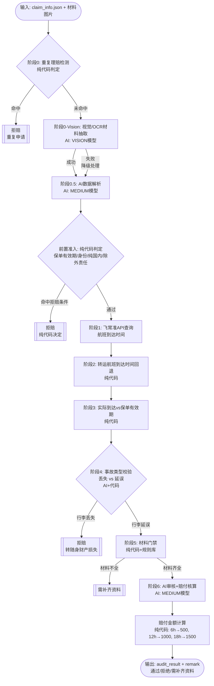
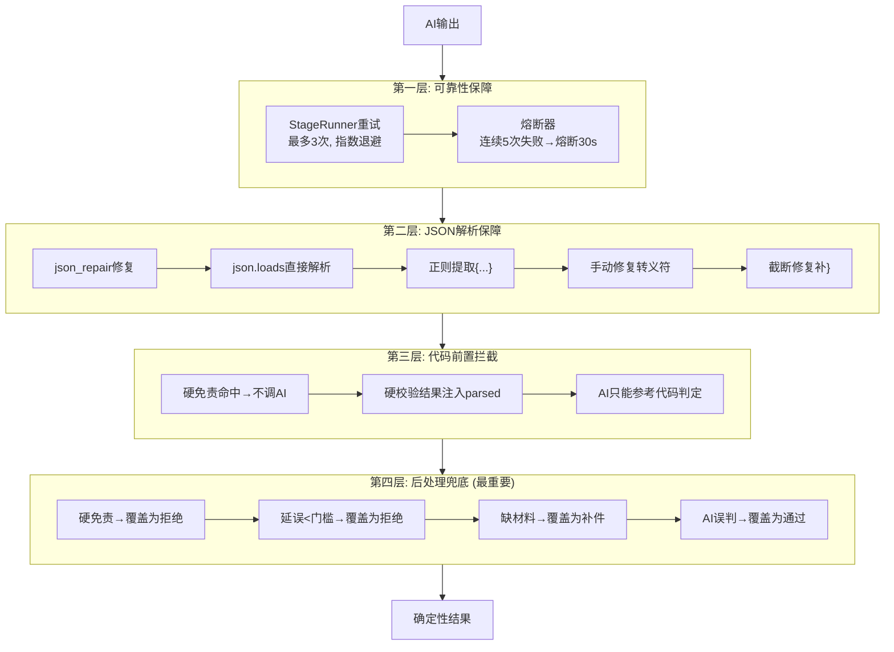

# 旅行险AI自动理赔审核流程

## 航班延误险审核流程

## 行李延误险审核流程

## AI不稳定性工程防御体系

## AI与代码分工表

| 任务 | 谁做 | 稳定性 | 说明 |
|------|:---:|:---:|------|
| 重复理赔检测 | 代码 | 100% | 身份证号+产品+险种+事故日+航班号匹配 |
| 视觉/OCR材料抽取 | AI | 不稳定 | 图片理解是AI强项 |
| 数据解析提取 | AI | 不稳定 | 非结构化文本需要AI理解 |
| 时区标准化 | AI | 不稳定 | 需要理解时间上下文 |
| 飞常准数据查询 | API | 100% | 权威数据源 |
| **硬免责检查** | **代码** | **100%** | 保单有效期/国内航班/中转/同天投保等 |
| 延误时长计算 | 代码 | 100% | 数学计算 |
| 材料完整性检查 | 代码 | 100% | 规则明确 |
| 理赔综合判定 | AI→代码兜底 | 不确定→确定 | AI先判，代码后覆盖 |
| 赔付金额计算 | 代码 | 100% | 档位查询 |
| **最终结果覆盖** | **代码** | **100%** | **确保结果确定性** |

## 核心原则

> **AI负责"提取和理解"，代码负责"判定和兜底"。**
>
> 所有关键判定（免责、门槛、材料）均在代码中完成，AI的输出会被代码验证、修正、覆盖。
> 系统设计保证：即使AI输出完全错误，最终结果仍由确定性规则控制。
